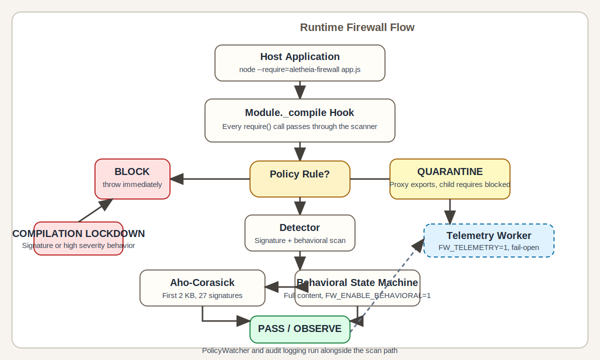

# Aletheia Firewall

A runtime security firewall for Node.js that intercepts module compilation to detect and block malicious packages through behavioral analysis, Aho-Corasick signature scanning, and policy enforcement.

**What this intercepts:** `require()`-time module compilation (signature + behavioral scan), the host project's own npm lifecycle scripts, and changes to the runtime policy file. **What this does NOT intercept in v0.1.0:** dependency `postinstall` hooks in `node_modules` (the npm installer runs those before the firewall loads), Bun/Deno (detection exits if preload is absent, but coverage is limited), and AST-obfuscated eval techniques (documented below as known bypasses).

---

## Architecture



---

## Security Features

### 1. Behavioral Detection (State Machine)

Tracks dangerous **action sequences** within and across modules — catching obfuscated threats that static signatures miss:

| Rule | Trigger | Severity |
|------|---------|----------|
| `CREDENTIAL_EXFILTRATION` | Reads `.env`/`.npmrc`/`process.env` AND makes network call | CRITICAL |
| `DYNAMIC_CODE_EXEC_CHAIN` | `eval`/`new Function` AND `child_process.exec` in same module | CRITICAL |
| `CROSS_MODULE_EXFILTRATION` | Prior module read credentials; this module makes network call | HIGH |
| `CROSS_MODULE_CODE_EXEC` | Prior module generated dynamic code; this module runs processes | HIGH |
| `DYNAMIC_MODULE_LOAD` | `require(variable)` or `module._load` with non-literal path | MEDIUM |

### 2. Signature Scanner (Aho-Corasick)

O(N) pattern matching with 27 signatures covering:

- Crypto-miners (`stratum`, `pool.hashvault`, `nicehash`, `cryptonight`, …)
- Dynamic code execution (`eval(`, `new Function`, `buffer.from`, `atob(`, …)
- Supply-chain worm patterns (`curl␠`, `wget␠`, `//pastebin`, …)
- Process execution (`child_process.exec`, `execSync`, `spawnSync`, …)
- Network egress (`https.request`, `http.request`, `net.createconnection`, …)

### 3. Policy Enforcement

Policy rules in `policy.signed.json` at the working directory:

```json
{
  "rules": {
    "malware.js": "BLOCK",
    "untrusted-pkg.js": "QUARANTINE",
    "noisy-lib.js": "OBSERVE"
  }
}
```

- **BLOCK**: Throws immediately, module code never runs.
- **QUARANTINE**: Module code does not run; exports replaced with a `Proxy` stub that logs all access attempts. The quarantined module cannot load any child modules.
- **OBSERVE** (default): Full behavioral + signature scan; blocks on any detection.

> **Naming note:** The `.signed` convention in `policy.signed.json` means the file is integrity-monitored at runtime via SHA-256 file hashing (see §4 below) — this is **not** asymmetric/cryptographic signing. No keys or certificates are involved.

### 4. Continuous Policy Integrity Verification

Every 60 seconds the policy file is re-read and its SHA-256 hash compared to the startup baseline. If the file has been tampered with → **emergency lockdown**: all subsequent module loads throw an error.

```text
[CRITICAL] Policy integrity violation detected. EMERGENCY LOCKDOWN ACTIVE.
```

### 5. Self-Integrity Check

On every startup the firewall computes a SHA-256 hash across all its own source files (`index.js`, `detector.js`, `behavior-tracker.js`, etc.) and compares it to `.helios-baseline`. If the firewall code has been tampered with, startup is aborted.

### 6. Runtime Detection (Bun / Deno)

If the process is running under Bun without `BUN_PRELOAD=aletheia-firewall`, the agent exits with code 1. Same for Deno without `DENO_PRELOAD`.

### 7. npm Lifecycle Script Scanning

On startup, the **host project's own** `package.json` scripts are scanned for suspicious patterns (`curl | bash`, `wget | sh`, `eval $`, `base64 --decode`, etc.) and blocked before any code runs. Disable with `HELIOS_BLOCK_SCRIPTS=0`.

> **Scope note:** Only the root `package.json` (at `process.cwd()`) is scanned. The npm installer runs dependency `postinstall` hooks before the firewall loads, so they are not covered by this scan.

### 8. Persistent Audit Log

Every security event is written as a JSON line to `/var/log/helios/audit.log` (falls back to `$TMPDIR/helios/audit.log`). Log files rotate at 10 MB, keeping 5 generations.

Override the log directory:

```bash
HELIOS_LOG_DIR=/data/logs node --require=aletheia-firewall app.js
```

### 9. Graceful Shutdown

`SIGTERM` / `SIGINT`: flushes pending telemetry, terminates the worker thread, flushes the audit log, then exits cleanly.

---

## Quick Start

**Prerequisites:** Node.js ≥ 18

```bash
git clone https://github.com/holeyfield33-art/runtime-firewall-mvp
cd runtime-firewall-mvp
npm install

# Start the control plane
node packages/fw-control/src/server.js

# Run your app with the firewall preloaded
FW_ENABLE_DETECTION=1 FW_TELEMETRY=1 node --require=./packages/fw-agent app.js
```

---

## Environment Variables

| Variable | Default | Description |
|----------|---------|-------------|
| `FW_ENABLE_DETECTION` | `0` | Set to `1` to activate the firewall (required) |
| `FW_ENABLE_BEHAVIORAL` | `1` | Set to `0` to disable the behavioral pass (signature scan always runs) |
| `FW_TELEMETRY` | `0` | Set to `1` to forward events to the control plane |
| `FW_CONTROL_PORT` | `3000` | Control plane port |
| `FW_STRICT_PRELOAD` | `0` | Set to `1` to exit if not loaded via `--require` |
| `FW_FREEZE_PROTOTYPES` | `0` | Set to `1` to freeze `Object/Array/Function/Promise/RegExp` prototypes on load (hardens against prototype pollution; may break libraries that extend built-ins) |
| `FW_POLICY_PUBKEY` | *(dev key)* | PEM-encoded Ed25519 SPKI public key used to verify `policy.signed.json`. **Must be set to your own key in production** — the bundled dev key's private half is public. |
| `FW_ALLOW_DEV_POLICY_KEY` | `0` | Set to `1` to allow the bundled dev key when `FW_POLICY_PUBKEY` is unset (local dev / CI only). The agent refuses to start with a policy file and no production key unless this flag is explicitly set. |
| `HELIOS_LOG_DIR` | `/var/log/helios` | Audit log directory |
| `HELIOS_DASHBOARD_TOKEN` | *(none)* | Bearer token for the `/logs` dashboard endpoint (fw-control only) |
| `HELIOS_BLOCK_SCRIPTS` | `1` | Set to `0` to warn instead of block suspicious npm scripts |
| `BUN_PRELOAD` | *(none)* | Must include `aletheia-firewall` when running under Bun |
| `DENO_PRELOAD` | *(none)* | Must include `aletheia-firewall` when running under Deno |

---

## Running Tests

```bash
# Unit tests (Aho-Corasick + Detector)
npm run test:unit

# Adversarial bypass test suite (14 cases, 14 passed)
npm run test:adversarial

# Integration / detection tests
npm run test:integration   # expects: Blocked: 1
npm run test:live          # expects: Blocked: 2

# Run all tests
npm test

# Honest overhead benchmark (spawns cold-cache child processes)
node packages/fw-agent/test/bench-honest.js
```

---

## Performance

**Measured on AMD EPYC (9V74 80-core and 7763 64-core Codespaces), Node v22 (CI: 18, 20, 22), cold 900-module load.**
All numbers come from `results/bench-n10-run-*.txt` (9V74) and `results/gate-3x-epyc-20260618.txt` (7763) in this repo.

| Metric | Measured | Gate budget | Enforced? |
|--------|----------|-------------|-----------|
| Median module-compile overhead | ~17–21% (varies by host) | 25% | **Yes** |
| P95 overhead | ~25–37% across hosts | 30% (reference) | No — informational only |

The ~17–21% median overhead (host-dependent: 7763 ~17%, 9V74 ~20–21%) is the honest, irreducible cost of full-content behavioral scanning across 900 modules on a cold load. It is not a bug or inefficiency — the scan path is already optimal (automaton built once, single-pass no-alloc Aho-Corasick, signature scan capped at 2 KB, cache short-circuits repeat compiles).

> **F-01 note:** v0.1.0 removed a sub-512B scan-skip that let small modules bypass scanning entirely. After the fix the measured median rose ~1–3pp over the pre-fix range of ~17–20%. The post-fix gate run is in `results/gate-post-f01.txt`.

The gate **enforces median only**. P95 tail latency is reported for operational transparency but is not a fail condition. On shared multi-core EPYC hardware, P95 reflects OS scheduler preemption of the synchronous main-thread scan (~25–37% across EPYC hosts — 9V74 ~26%, 7763 ~34%), not firewall algorithmic cost. Because P95 is host-dependent and not stable across hardware, gating on it would be gating on noise.

The gate is a **regression guard**, not a performance target: if a code change causes the median to exceed 25%, something went wrong.

**Scan design:**

- Signature scan: Aho-Corasick, capped at first 2 KB per module (signatures reliably appear early in malicious payloads).
- Behavioral scan: full-content regex state machine (action sequences span arbitrary lengths; capping would miss multi-phase attacks). Disable with `FW_ENABLE_BEHAVIORAL=0` for signature-only mode.

---

## Adversarial Bypass Status

| Technique | Status | Notes |
|-----------|--------|-------|
| Direct `eval("code")` | **BLOCKED** | Aho-Corasick signature |
| `Buffer.from(b64).toString() → eval` | **BLOCKED** | Signature (`buffer.from`) |
| Crypto-miner stratum URL | **BLOCKED** | Signature (`stratum`, `pool.hashvault`) |
| `process.env` + network call | **BLOCKED** | Behavioral: `CREDENTIAL_EXFILTRATION` |
| `eval` + `child_process.exec` | **BLOCKED** | Behavioral: `DYNAMIC_CODE_EXEC_CHAIN` |
| `curl \| bash` in host project's npm scripts | **BLOCKED** | npm script scanner (root `package.json` only; dependency `postinstall` hooks run before the firewall loads) |
| Bracket eval: `this["ev"+"al"]` | **BYPASSES** | Needs AST / V8 Inspector |
| String concat: `global["ev"+"al"]` | **BYPASSES** | Needs taint tracking |
| Array join: `["ch","ild"].join("")` | **BYPASSES** | Needs dynamic analysis |
| Prototype chain: `eval.constructor` | **BYPASSES** | Needs runtime instrumentation |

All bypasses require dynamic (runtime) analysis. Static analysis is fundamentally limited against these techniques. Behavioral detection provides defense-in-depth by flagging dangerous action sequences even when individual primitives are obfuscated.

---

## Docker Compose

```bash
HELIOS_DASHBOARD_TOKEN=mysecret docker compose up

# View dashboard (JSON)
curl -H "Authorization: Bearer mysecret" http://localhost:3000/logs

# View dashboard (HTML)
curl -H "Accept: text/html" -H "Authorization: Bearer mysecret" http://localhost:3000/logs
```

---

## Acceptance Criteria Status

| Criterion | Status |
|-----------|--------|
| Obfuscated eval is blocked | ✅ `buffer.from` → blocked; bracket/concat eval → documented bypass |
| Host project postinstall script fetching remote payload is blocked | ✅ npm script scanner + `curl` signature (root `package.json` only — dependency `postinstall` hooks are out of scope) |
| Policy file replaced at runtime → emergency lockdown | ✅ `PolicyWatcher` (60s interval) |
| Quarantined module cannot read `process.env` or make network calls | ✅ `QuarantineStub` Proxy replaces exports; child requires blocked |
| Telemetry persists across restarts | ✅ Append-only JSON log at `/var/log/helios/audit.log` |
| SIGTERM shuts down workers cleanly | ✅ Worker `TERMINATE` message + `Promise.all` await |
| Adversarial test suite passes or documents remaining bypasses | ✅ 14 tests, bypasses documented |

---

## Roadmap

- [x] Phase 1: Async telemetry & statistical performance guardrails
- [x] Phase 2: Signature detection engine & enforcement matrix
- [x] Phase 3: Helios Core integrity anchoring & forensic auditing
- [x] Phase 4: Behavioral state machine, quarantine enforcement, persistent audit log
- [ ] Phase 5: AST-level analysis for obfuscation-resistant detection
- [ ] Phase 6: ClickHouse analytics integration & distributed policy propagation
