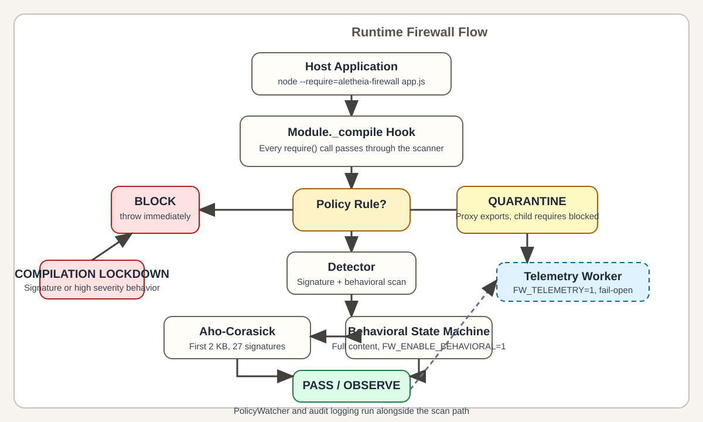

# Aletheia Firewall

[](https://github.com/holeyfield33-art/runtime-firewall-mvp/actions/workflows/ci.yml)
[](https://github.com/holeyfield33-art/runtime-firewall-mvp/security/code-scanning)
[](https://www.npmjs.com/package/aletheia-firewall)
[](https://www.npmjs.com/package/aletheia-firewall?activeTab=code)

A runtime security firewall for Node.js that intercepts module compilation to detect and block malicious packages through behavioral analysis, Aho-Corasick signature scanning, and policy enforcement.

**What this intercepts:** `require()`-time module compilation (signature + behavioral scan), ESM `import`/`import()` on Node ≥22.15.0/≥23.5.0 (see below), the host project's own npm lifecycle scripts, and changes to the runtime policy file. **What this does NOT intercept:** dependency `postinstall` hooks in `node_modules` (the npm installer runs those before the firewall loads), Bun/Deno (detection exits if preload is absent, but coverage is limited), ESM on older Node versions (see the version-floor note below), and AST-obfuscated eval techniques (documented below as known bypasses).

> **See it in 30 seconds:** clone the repo, run `npm install`, then `bash demo/demo.sh`. It loads a crypto-miner and a credential stealer with the firewall off (they run) and on (both blocked), plus a normal analytics module that is correctly allowed. See [Demo](#demo) below.

---

## Coverage & Limitations

Aletheia hooks `Module.prototype._compile` (Node's CommonJS compilation step) and, on a
supported Node version, `module.registerHooks()` (Node's synchronous ESM Customization Hooks
API) for the ES module loader. This means:

| Load path | Covered |
|---|---|
| `require()` of `.js` / `.cjs` | ✅ |
| `import` / `import()` (ESM, `.mjs`, or `.js` under `"type": "module"`) | ✅ on Node ≥22.15.0 / ≥23.5.0 — ❌ below that floor (see note) |
| `.json` requires | ❌ handled by Node core, bypasses `_compile` |
| Native addons (`.node`) | ❌ not JS, not scanned |
| Dependency npm lifecycle scripts (preinstall/postinstall) | ❌ run before the firewall loads |
| `require.cache` pre-seeding (a forged module or bare `{ exports }` object inserted directly into `require.cache`, bypassing `_compile` entirely) | ✅ policy-controlled via `FW_CACHE_POLICY` (see Environment Variables) — `Module._load` itself is wrapped, not just `_compile` |

**ESM version floor:** `module.registerHooks()` — the non-deprecated, synchronous ESM hook API —
requires Node ≥22.15.0 or ≥23.5.0. The package's declared `engines` floor (`>=18.0.0`) covers
its CommonJS functionality; below the ESM-specific floor, `import`/`import()` runs
**unprotected**, with a loud, logged warning (`FW_MODE=enforce` treats it as a hard failure) —
never silently claimed as covered. ESM policy `QUARANTINE` also has no equivalent to CJS's live
export-stub substitution (there's no module object to swap mid-evaluation from inside a load
hook) and degrades to `BLOCK` instead — the module still never runs, it just isn't handed a
fake, inert replacement export the way CJS `QUARANTINE` is.

**`require.cache` pre-seeding:** `Module._load()` — the real `require()` entry point — checks
`require.cache` *before* `Module.prototype._compile` ever runs, so wrapping only `_compile` left
a gap: allowed code could insert a forged module (or even a bare `{ exports }` object) directly
into `require.cache[resolvedPath]` and `require()` would return the forged exports without the
target's real code ever executing or being scanned. `Module._load` is now wrapped too, with a
three-state model (verified / unknown / blocked) — see `FW_CACHE_POLICY` in Environment
Variables. This closes that *specific* mechanism — `require.cache` **pre-seeding** that bypasses
the scan path. It does **not** close reassignment of the loader functions themselves, and does not
claim to close the broader same-process ceiling: sufficiently-privileged code already running
inside a protected process can manipulate Node's runtime module-loading mechanisms (`Module._load`,
`Module.prototype._compile`, `module.registerHooks()`) — the firewall's own enforcement points —
in ways the firewall cannot reliably prevent, because it runs at the same privilege level as the
code it inspects. This is an inherent limit of same-process defense, not a closable gap; see
[SECURITY.md](SECURITY.md) for the detailed mechanics.

Aletheia is a **runtime enforcement layer**: it watches what a dependency does once it's
already in your require/import graph, after `npm install` has finished. It is not an
install-time scanner and does not intercept package installation.

Detection is signature + behavioral by default, so payloads can evade static matching through
string-splitting, encoding, or indirection. Our adversarial corpus documents this honestly:
**105/143 (73.4%) of malicious payloads caught, 38 known bypasses, 0 false positives** on the
current corpus with default settings — run it yourself with `npm run redteam`. An **opt-in**
AST-detection tier (`FW_ENABLE_AST=1`, off by default pending soak) closes 22 of those 38
bypasses — **127/143 (88.8%)** — run `npm run redteam:ast` to see it. Every remaining bypass
class is listed in [`red-team/README.md`](red-team/README.md) and
[`docs/THREAT-COVERAGE.md`](docs/THREAT-COVERAGE.md). "0 false positives" means zero across the
36 curated benign controls, not a measured general false-positive rate — which is one reason the
AST tier ships opt-in.

---

## Architecture



---

## Security Features

### 1. Behavioral Detection (State Machine)

Tracks dangerous **action sequences** within and across modules — catching obfuscated threats that static signatures miss:

| Rule | Trigger | Severity | Action |
|------|---------|----------|--------|
| `CREDENTIAL_EXFILTRATION` | Reads `.env`/`.ssh`/`id_rsa`/etc. sensitive path AND makes network call (or `.npmrc` + a token field / host override / hardcoded non-registry destination) | CRITICAL | Block |
| `DYNAMIC_CODE_EXEC_CHAIN` | `eval`/`new Function` AND `child_process.exec` in same module | CRITICAL | Block |
| `OBFUSCATED_CODE_EXECUTION` | Decodes an encoded blob (`Buffer.from(…,'base64'/'hex')` / `atob`) AND evaluates it as code (`eval`/`new Function`/`vm`) | HIGH | Block |
| `NPMRC_NETWORK_EGRESS` | Reads `.npmrc` + network call, destination built from config (legit npm tooling shape) | WARN | Observe |
| `ENV_NETWORK_EGRESS` | Reads `process.env` AND makes network call (the everyday SDK pattern) | WARN | Observe |
| `DYNAMIC_MODULE_LOAD` | `require(variable)` or `module._load` with non-literal path | MEDIUM | Observe (telemetry only — non-literal `require` is pervasive in legitimate code, so it is surfaced, not blocked) |

> Behavioral rules are evaluated per-module against full content. HIGH/CRITICAL rules hard-block
> the `require()`; WARN/MEDIUM rules emit an `OBSERVE` telemetry event and let the module run.

### 2. Signature Scanner (Aho-Corasick)

O(N) pattern matching with 32 signatures (14 block-tier + 18 warn-tier) covering:

- Crypto-miners (`stratum`, `pool.hashvault`, `nicehash`, `cryptonight`, …)
- Dynamic code execution (`eval(`, `new Function`, `buffer.from`, `atob(`, …)
- Supply-chain worm patterns (`curl␠`, `wget␠`, `//pastebin`, …)
- Process execution (`child_process.exec`, `execSync`, `spawnSync`, …)
- Network egress (`https.request`, `http.request`, `net.createconnection`, …)

### 3. Policy Enforcement

Policy rules live in `policy.signed.json` at the working directory. **The file must carry a
valid Ed25519 signature** — an unsigned `{ "rules": … }` object fails verification on startup
and triggers emergency lockdown (all module loads blocked). Do not hand-write the file; author a
plain rules file and sign it:

```bash
# rules.json — just the rule map
echo '{ "malware.js": "BLOCK", "untrusted-pkg.js": "QUARANTINE", "noisy-lib.js": "OBSERVE" }' > rules.json

# Sign it into policy.signed.json. There is no bundled/committed dev private key -- generate
# your own local-only key first (never commit it), then sign with it. For local/dev/CI you
# must also set FW_ALLOW_DEV_POLICY_KEY=1 at runtime to accept a key matching the bundled
# DEV_PUBLIC_KEY_PEM default; in production, set FW_POLICY_PUBKEY to your own public key instead.
node scripts/generate-policy-key.js   # prints a fresh keypair; keep the private key local-only
node scripts/sign-policy.js /path/to/your-private-key.pem rules.json policy.signed.json
```

The resulting `policy.signed.json` is a signed envelope: `{ version, rules, signedAt, signature }`.

- **BLOCK**: Throws immediately, module code never runs.
- **QUARANTINE**: Module code does not run; exports replaced with a `Proxy` stub that logs all access attempts. The quarantined module cannot load any child modules.
- **OBSERVE** (default): Full behavioral + signature scan; blocks on any detection.

> **Naming note:** `policy.signed.json` carries a real **Ed25519 signature** over its canonical payload (`{ version, rules (keys sorted), signedAt }`). The public key is compiled into `src/policy-watcher.js` (override with `FW_POLICY_PUBKEY`); sign policy files with `scripts/sign-policy.js`. Since v0.2.0 this replaces the earlier SHA-256 trust-on-first-use baseline.

### 4. Continuous Policy Integrity Verification

Every 60 seconds, the policy file is reloaded and its Ed25519 signature is verified against the configured public key. If verification fails or the policy file is missing, the agent enters **emergency lockdown** and all subsequent module loads throw an error. A valid policy update is hot-reloaded in place without requiring a restart.

```text
[CRITICAL] Policy integrity violation detected. EMERGENCY LOCKDOWN ACTIVE.
```

### 5. Self-Integrity Check

On every startup the firewall computes a SHA-256 hash across all its own source files (`index.js`, `detector.js`, `behavior-tracker.js`, etc.) and compares it to `.helios-baseline`. If the firewall code has been tampered with, startup is aborted. The hash is computed over line-ending-normalized (`\r\n` → `\n`) UTF-8 content, so the check is stable across Linux, macOS, Windows, and CI checkouts (a `.gitattributes` at the repo root also enforces LF for text files).

### 6. Runtime Detection (Bun / Deno)

If the process is running under Bun without `BUN_PRELOAD=aletheia-firewall`, the agent exits with code 1. Same for Deno without `DENO_PRELOAD`.

### 7. npm Lifecycle Script Scanning

On startup, the **host project's own** `package.json` scripts are scanned for suspicious patterns (`curl | bash`, `wget | sh`, `eval $`, `base64 --decode`, etc.) and blocked before any code runs. Disable with `HELIOS_BLOCK_SCRIPTS=0`.

> **Scope note:** Only the root `package.json` (at `process.cwd()`) is scanned. The npm installer runs dependency `postinstall` hooks before the firewall loads, so they are not covered by this scan.

### 8. Persistent Audit Log

Every security event is written as a JSON line to `/var/log/helios/audit.log` (falls back to `$TMPDIR/helios/audit.log`). Log files rotate at 10 MB, keeping 5 generations.

Override the log directory:

```bash
HELIOS_LOG_DIR=/data/logs node --require=aletheia-firewall app.js
```

### 9. Graceful Shutdown

`SIGTERM` / `SIGINT`: flushes pending telemetry, terminates the worker thread, flushes the audit log, then exits cleanly.

---

## Quick Start

**Prerequisites:** Node.js ≥ 18

The optional fw-control dashboard/telemetry server requires Node.js ≥ 20 (Fastify 5); the firewall agent itself only needs Node.js ≥ 18. That floor covers CommonJS `require()` coverage, which is this project's core guarantee. ESM (`import`/`import()`) interception needs a newer Node — ≥22.15.0 or ≥23.5.0 — and runs as a disclosed, unprotected bypass below that floor; CommonJS coverage is unaffected either way. See the Coverage table above and `packages/fw-agent/README.md` for the full breakdown.

```bash
git clone https://github.com/holeyfield33-art/runtime-firewall-mvp
cd runtime-firewall-mvp
npm install

# Run your app with the firewall preloaded
FW_ENABLE_DETECTION=1 node --require=./packages/fw-agent app.js
```

To also forward events to the control plane dashboard, start it in a second
terminal and add `FW_TELEMETRY=1`:

```bash
# Terminal 1 — control plane (telemetry + dashboard on :3000)
node packages/fw-control/src/server.js

# Terminal 2 — your app, reporting to the control plane
FW_ENABLE_DETECTION=1 FW_TELEMETRY=1 node --require=./packages/fw-agent app.js
```

> **Run `npm install` first.** The control plane depends on `fastify`, which is
> installed as part of the workspace. If you start the server before installing
> dependencies it exits immediately with a clear message
> (`the "fastify" dependency is not installed`) — run `npm install` in the repo
> root and start it again. The `/logs` dashboard is served at
> `http://127.0.0.1:3000/logs`; it always requires a bearer token (set
> `HELIOS_DASHBOARD_TOKEN`, or the server prints an auto-generated one at
> startup). Check it's up with `curl http://127.0.0.1:3000/v1/health`.

> **Preload note:** `--require=./packages/fw-agent` loads the agent *before* your
> app's code, so every `require()` your app makes is screened from the very first
> module. Loading the agent with a plain `require('./packages/fw-agent')` inside
> your app also works but leaves modules loaded earlier unprotected (the agent
> prints a warning). The agent is a no-op unless `FW_ENABLE_DETECTION=1` is set.

### Enforcement mode vs Development mode

The agent always checks whether it was genuinely preloaded via `--require` (not
spoofable by `node -e "require('aletheia-firewall')"` — see `verifyPreloadManifold`
in `index.js`). What happens when that check fails depends on `FW_MODE`:

| `FW_MODE` | Not preloaded via `--require` |
|-----------|--------------------------------|
| `enforce` | **Fails closed.** Prints `[CRITICAL] ...` and calls `process.exit(1)`. Nothing runs unprotected. `FW_STRICT_PRELOAD=1` is a backward-compatible alias for this. |
| `dev` (default, unset) | **Fails open.** Prints one high-visibility warning banner to stderr and continues. Modules loaded before the agent attached are *not* protected, and modules loaded after it in the same process still are. |

**Be honest with yourself about which one you're running.** The default is
`dev` so that programmatic loading, REPLs, and test harnesses keep working out
of the box — but it is a fail-*open* default, not fail-closed. Production
deployments that need a hard guarantee should set `FW_MODE=enforce` explicitly
and preload the agent with `--require`. Both modes emit a startup audit/telemetry
event (`FW_MODE_ENFORCE` / `FW_MODE_DEV`) recording which one was active, so a
deployment's actual posture is auditable after the fact.

---

## Demo

The fastest way to see the firewall work end-to-end — no app of your own needed:

```bash
npm install        # first time only
bash demo/demo.sh
```

The script runs the same two "apps" three times and prints a labelled trace:

1. **Firewall OFF** — a malicious app loads a crypto-miner and a credential
   stealer; both run freely (you see their payload messages print).
2. **Firewall ON** — the same malicious app is blocked at `require()`; neither
   payload runs (`[BLOCKED] ... crypto-miner` / `... CREDENTIAL_EXFILTRATION`).
3. **Firewall ON** — a normal app with an ordinary analytics dependency (reads
   `process.env`, makes an HTTPS call) loads fine — **no false alarm**.

That last point is the whole design goal: block real malware without flagging
the everyday env-read + network pattern that legitimate SDKs use. See
[`demo/README.md`](demo/README.md) for a file-by-file breakdown.

---

## Research Monitor

`monitor.js` (repo root) is a standalone, **logging-only** tool that reuses
the detection engine to continuously scan a project's `node_modules` and
report CRITICAL/HIGH threats — without blocking anything. It's for
dogfooding the detector against real dependency trees, not for production
enforcement (use the firewall agent above for that).

```bash
node monitor.js [path-to-target-project]   # defaults to the current directory
```

Findings are appended as JSON lines to `research.log` at the repo root. See
[`docs/MONITOR.md`](docs/MONITOR.md) for the full run manual, log format,
and troubleshooting.

---

## Environment Variables

| Variable | Default | Description |
|----------|---------|-------------|
| `FW_ENABLE_DETECTION` | `0` | Set to `1` to activate the firewall (required) |
| `FW_ENABLE_BEHAVIORAL` | `1` | Set to `0` to disable the behavioral pass (signature scan always runs) |
| `FW_TELEMETRY` | `0` | Set to `1` to forward events to the control plane |
| `FW_CONTROL_PORT` | `3000` | Control plane port |
| `FW_MODE` | `dev` | `enforce` fails closed (exits) when not preloaded via `--require`; `dev` warns and continues. See "Enforcement mode vs Development mode" above. |
| `FW_STRICT_PRELOAD` | `0` | Set to `1` to exit if not loaded via `--require` (backward-compatible alias for `FW_MODE=enforce`) |
| `FW_FREEZE_PROTOTYPES` | `0` | Set to `1` to freeze `Object/Array/Function/Promise/RegExp` prototypes on load (hardens against prototype pollution; may break libraries that extend built-ins) |
| `FW_HARDEN_MODULE_PRIMITIVES` | `0` | Set to `1` to freeze `Module.prototype._compile` non-writable/non-configurable after the agent patches it, raising the cost of a later monkeypatch. Complementary to `FW_CACHE_POLICY` below, not a substitute — does nothing against `require.cache` poisoning. Same compatibility caveat as `FW_FREEZE_PROTOTYPES`: may break loaders/instrumentation/transpilers that legitimately re-patch `_compile`. |
| `FW_CACHE_POLICY` | `block` under `FW_MODE=enforce`, `audit` otherwise | Controls what happens when `require()` finds a `require.cache` entry for a `.js`/`.cjs` path the firewall never verified via `_compile` (possible cache-substitution attack, or legitimate cache pre-seeding by test-mocking/HMR tooling — cache state alone can't tell these apart). `block` refuses the load; `audit` allows it but logs a visible `CACHE_SUBSTITUTION_DETECTED` event (console + persistent audit log); `allow` allows it silently to the console (still logged to disk). |
| `FW_POLICY_PUBKEY` | *(dev key)* | PEM-encoded Ed25519 SPKI public key used to verify `policy.signed.json`. **Must be set to your own key in production** — there is no shared, committed dev key any more (see `SECURITY.md`); generate your own with `node scripts/generate-policy-key.js`. |
| `FW_ALLOW_DEV_POLICY_KEY` | `0` | Set to `1` to allow the bundled dev key when `FW_POLICY_PUBKEY` is unset (local dev / CI only). The agent refuses to start with a policy file and no production key unless this flag is explicitly set. |
| `HELIOS_LOG_DIR` | `/var/log/helios` | Audit log directory |
| `HELIOS_DASHBOARD_TOKEN` | *(none)* | Bearer token for the `/logs` dashboard endpoint (fw-control only) |
| `HELIOS_BLOCK_SCRIPTS` | `1` | Set to `0` to warn instead of block suspicious npm scripts |
| `BUN_PRELOAD` | *(none)* | Must include `aletheia-firewall` when running under Bun |
| `DENO_PRELOAD` | *(none)* | Must include `aletheia-firewall` when running under Deno |

---

## Running Tests

```bash
# Unit tests (Aho-Corasick + Detector)
npm run test:unit

# Adversarial bypass test suite (52 cases, all passing)
npm run test:adversarial

# Control-plane authentication tests (dashboard + telemetry auth)
npm run test:auth

# Integration / detection tests
npm run test:integration   # expects: Blocked: 1
npm run test:live          # expects: Blocked: 2

# Run all tests
npm test

# Honest overhead benchmark (spawns cold-cache child processes)
node packages/fw-agent/test/bench-honest.js
```

> All test commands need dependencies installed first (`npm install`) — the
> integration and control-plane auth tests load the `fastify`-based control
> plane.

### Red-team attack suite

A standalone adversarial harness fires **151 malicious/benign JavaScript module
payloads** at the detector and logs what gets **blocked (QUARANTINE)** vs. what
gets **through (OBSERVE)**, with per-category gap analysis and a false-positive
check. It writes a machine-readable `results/redteam-summary.json` and fails
only on a new bypass (regression) or an over-block, so it doubles as a CI
guardrail.

```bash
npm run redteam            # full suite + human-readable report + JSON summary
npm run redteam:bypass     # only show what got through
node red-team/run.js --category credential-exfil   # one category
```

See [`red-team/README.md`](red-team/README.md) for the corpus layout, the
verdict model, and the current inventory of documented firewall blind spots.

---

## Performance

The v0.4.0 performance evidence is frozen in `PERFORMANCE.md`. This repo maintains a 25% median compilation overhead budget for the gate (`npm run gate`).

**v0.4.0 measured evidence:** a first-party run on a 4-core machine measured **17.68% median overhead**, within budget. `PERFORMANCE.md` also documents a core-count sensitivity pattern across five environments spanning two release cycles: every run with 4+ confirmed logical cores has passed in the 16.47–17.68% band on the v0.4.0 commit, while lower-core/shared environments (2-core GitHub Codespaces on v0.4.0, plus an earlier pre-v0.4.0 audit sandbox) have failed in the 39–61% range. The gate's cold-process-spawn design is the suspected cause — baseline and agent subprocesses compete for scheduler time on constrained hardware — but this is a well-evidenced pattern across commits, not a same-commit controlled experiment or a proven root cause. `npm run gate` now prints a low-core-count warning when it fails on a machine with fewer than 4 logical cores.

| Metric | Recorded budget | Enforced? |
|--------|-----------------|-----------|
| Median module-compile overhead | 25% | **Manual only — not yet wired into CI** (see `AUDIT.md` finding #4) |
| P95 overhead | 30% (informational only) | No |

The gate is a **regression guard**, not a release performance claim. If a code change causes the median to exceed 25% *on hardware with at least 4 confirmed logical cores*, the gate is doing its job by catching a regression.

### v0.4.0 performance baseline

- gate output: `results/gate-v0.4.0-*.txt`
- full test suite: `results/full-test-v0.4.0-*.txt`
- raw benchmark artifacts: `results/benchmarks/raw/bench-*.json`

These, plus `PERFORMANCE.md`, are the authoritative current evidence.

### What this means

- `Module._compile` interception cost is the primary steady-state performance factor.
- `FW_ENABLE_DETECTION=0` remains zero-overhead for normal runtime operation.
- Run the gate on hardware with 4+ logical cores for a meaningful result; see `PERFORMANCE.md`'s "Core-count sensitivity" section for the full cross-environment evidence before treating a low-core FAIL as a real regression.

For the latest baseline and detailed methodology, see `PERFORMANCE.md`.

---

## Adversarial Bypass Status

| Technique | Status | Notes |
|-----------|--------|-------|
| Direct `eval("code")` + exec | **BLOCKED** | Behavioral: `DYNAMIC_CODE_EXEC_CHAIN` |
| `Buffer.from(b64,'base64').toString() → eval` | **BLOCKED** | Behavioral: `OBFUSCATED_CODE_EXECUTION` (decode + eval). Note: bare `buffer.from`/`eval(` are WARN-only signatures — it is the *decode-then-evaluate combination* that blocks (F-31). |
| `atob(blob)` / hex-decode → `new Function` | **BLOCKED** | Behavioral: `OBFUSCATED_CODE_EXECUTION` |
| Crypto-miner stratum URL | **BLOCKED** | Signature (`stratum+tcp`, `stratum://`, `pool.hashvault`) |
| `.env`/credential read + network call | **BLOCKED** | Behavioral: `CREDENTIAL_EXFILTRATION` |
| `eval` + `child_process.exec` | **BLOCKED** | Behavioral: `DYNAMIC_CODE_EXEC_CHAIN` |
| `curl \| bash` in host project's npm scripts | **BLOCKED** | npm script scanner (root `package.json` only; dependency `postinstall` hooks run before the firewall loads) |
| Bracket eval: `this["ev"+"al"]` | **BYPASSES** | Needs AST / V8 Inspector |
| String concat: `global["ev"+"al"]` | **BYPASSES** | Needs taint tracking |
| Variable-alias eval: `const fn = eval; fn("code")` | **BYPASSES** | Needs runtime Proxy / taint tracking |
| Array join: `["ch","ild"].join("")` | **BYPASSES (per-module)** | May be caught in practice by cross-module behavioral state |
| Prototype chain: `eval.constructor` | **BYPASSES** | Needs runtime instrumentation |

The remaining bypasses require dynamic (runtime) analysis; static analysis is fundamentally limited against them. See [`docs/THREAT-COVERAGE.md`](docs/THREAT-COVERAGE.md) for the full, test-backed matrix of what is protected and what is not. Behavioral detection provides defense-in-depth by flagging dangerous action *sequences* even when individual primitives are obfuscated.

---

## Docker Compose

```bash
HELIOS_DASHBOARD_TOKEN=mysecret docker compose up

# View dashboard (JSON)
curl -H "Authorization: Bearer mysecret" http://localhost:3000/logs

# View dashboard (HTML)
curl -H "Accept: text/html" -H "Authorization: Bearer mysecret" http://localhost:3000/logs
```

---

## Acceptance Criteria Status

| Criterion | Status |
|-----------|--------|
| Obfuscated eval is blocked | ✅ `buffer.from` → blocked; bracket/concat eval → documented bypass |
| Host project postinstall script fetching remote payload is blocked | ✅ npm script scanner + `curl` signature (root `package.json` only — dependency `postinstall` hooks are out of scope) |
| Policy file replaced at runtime → emergency lockdown | ✅ `PolicyWatcher` (60s interval) |
| Quarantined module cannot read `process.env` or make network calls | ✅ `QuarantineStub` Proxy replaces exports; child requires blocked |
| Telemetry persists across restarts | ✅ Append-only JSON log at `/var/log/helios/audit.log` |
| SIGTERM shuts down workers cleanly | ✅ Worker `TERMINATE` message + `Promise.all` await |
| Adversarial test suite passes or documents remaining bypasses | ✅ 52 tests, bypasses documented in `docs/THREAT-COVERAGE.md` |

---

## Roadmap

- [x] Phase 1: Async telemetry & statistical performance guardrails
- [x] Phase 2: Signature detection engine & enforcement matrix
- [x] Phase 3: Helios Core integrity anchoring & forensic auditing
- [x] Phase 4: Behavioral state machine, quarantine enforcement, persistent audit log
- [~] Phase 5: AST-level analysis for obfuscation-resistant detection — landed in `aletheia-firewall@0.6.0` as an **opt-in** tier (`FW_ENABLE_AST=1`, off by default pending soak). Closes 18 of the 30 previously-documented static-analysis bypasses (bracket/alias/unicode-escape eval, constructor-chase sandbox escapes, decode-primitive chains, literal string/path reassembly) when enabled; WASM, env-sourced config values, and network+process-exec taint chains remain open by design — see `docs/THREAT-COVERAGE.md` §4 and `packages/fw-agent/src/ast-scan.js`. Not marked done: it's a scoped, additional tier, not full AST coverage.
- [ ] Phase 6: ClickHouse analytics integration & distributed policy propagation

---

## Provenance & Supply-Chain Security

This is about how **this package itself** is published, distinct from the detection features above.

Every release from `v0.6.0` onward is published via [npm Trusted Publishing](https://docs.npmjs.com/generating-provenance-statements) — a tag-triggered GitHub Actions workflow (`.github/workflows/publish.yml`) that negotiates a short-lived OIDC token with npm at publish time. There is no long-lived npm token stored anywhere, and the exact tarball that passes CI is the one published — no manual `npm publish` step in the release path.

This produces a [SLSA provenance](https://slsa.dev/provenance/v1) attestation, publicly verifiable on the npm package page or via:

```bash
npm view aletheia-firewall@0.6.0 dist.attestations
```

or

```bash
npm audit signatures
```

after installing. This tells you the package was built by this repo's own CI from a specific, inspectable commit — not hand-published from someone's laptop.

---

## License

Apache License 2.0 — see [LICENSE](LICENSE).
